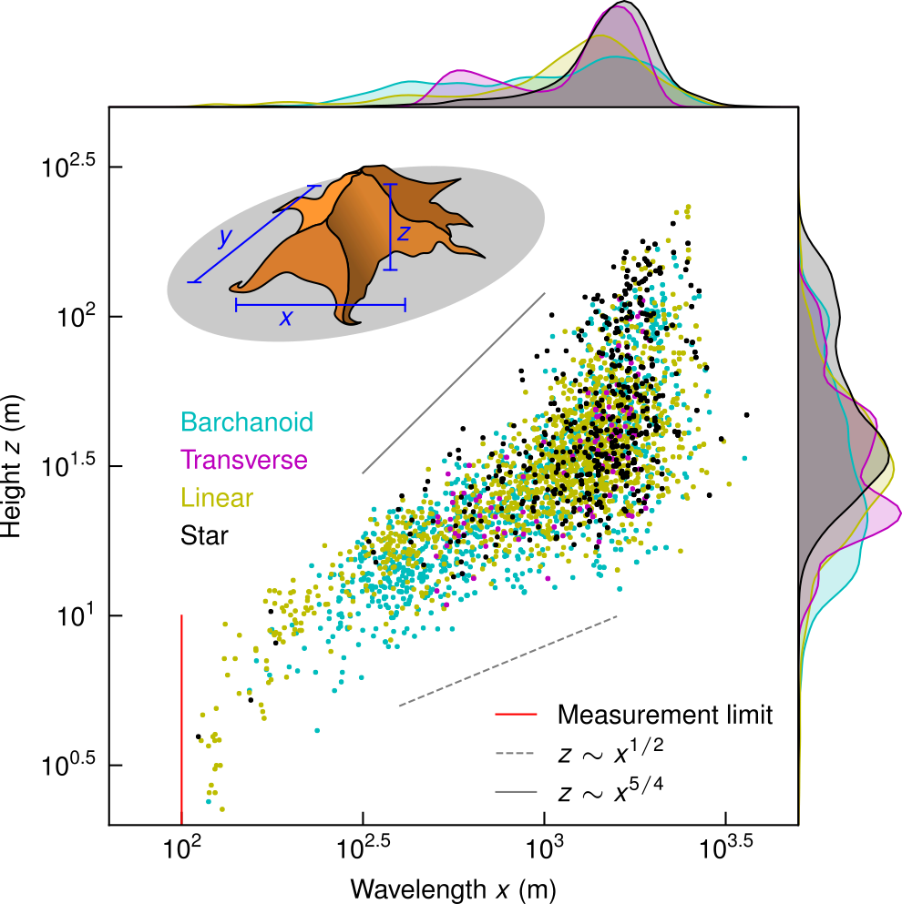

# Monash EAE Data Analysis in Earth Sciences

## Description

This is the site accompanying the 2-week intensive for research students in the Monash University School of Earth, Atmosphere and Environment. The course description is:
 
> Techniques for handling, analysing and presenting data in Earth Sciences using Python. Students will use real-world data provided to them or from their own research. The analysis component will include standard techniques such as correlations, power spectra, regridding and curve-fitting.

The practical goal of the intensive is to have students gain confidence in handling and plotting their own data in Python. The in-person aspect to this intensive is 9 days of 2-hour workshops where we go through the tutorials and solve any bugs collaboratively. 

The aim is to save students all the time I spent learning how to make nice figures so they can use it thinking about science instead! Students will leave with the ability to reproducibly generate figures like this: 

## Course materials

### [Day 1](./day1.html)
- Overview
- Installations
- First notebook

### [Day 2](./day2.html)
- Importing various data types

### [Day 3](./day3.html)
- Linear regression

### [Day 4](./day4.html)
- Power spectra

### [Day 5](./day5.html)
- Regridding

### [Day 6](./day6.html)
- Curve fitting

### [Day 7](./day7.html)
- Publication figures

### [Day 8](./day8.html)
- Github repository DOIs

### [Day 9](./day9.html)
- Lightning presentations

## Contact

This course and site was created by [Andrew Gunn](https://www.geomorphlab.org/people#h.bp27h9m9sgu5).
