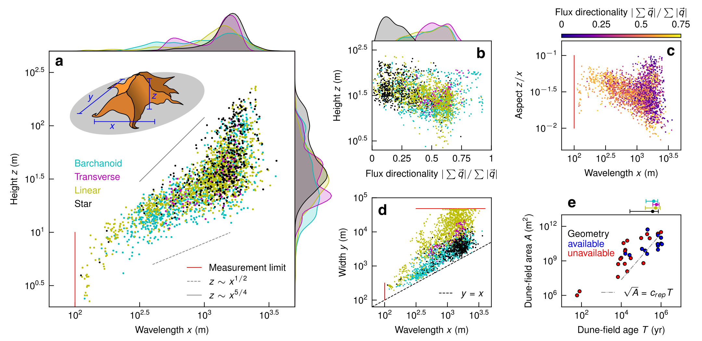

# Monash EAE Data Analysis in Earth Sciences

## Description

This is the site accompanying the 2-week intensive for research students in the Monash University School of Earth, Atmosphere and Environment. The course description is:
 
> Techniques for handling, analysing and presenting data in Earth Sciences using Python. Students will use real-world data provided to them or from their own research. The analysis component will include standard techniques such as correlations, power spectra, regridding and curve-fitting.

### Aims

The practical goal of the intensive is to have students gain confidence in handling and plotting their own data in Python. The in-person aspect to this intensive is 9 days of 2-hour workshops where we go through the tutorials and solve any bugs collaboratively. 

The aim is to save students all the time I spent learning how to make nice figures so they can use it to "do science" instead! Students will leave with the ability to reproducibly generate figures like this entirely in Python: 

### Assessment

There is ungraded homework each day which students get feedback on the next day in-person. For students taking this course for credit, there is one assessment. That assessment is producing an extended abstract (template [here](./assets/modified_lpsc_extended_abstract_template.docx)) with figures produced using the methods developed in the intensive. This abstract will be accompanied by a GitHub repository, minted with a DOI using Zenodo, that includes code (and data if storage allows) to produce the abstract figures.

## Course materials

### [Day 1 - Introduction](./day1.html)
- Overview
- Installations
- First notebook

### [Day 2 - Loading data](./day2.html)
- Function arguments
- Importing various data types

### [Day 3 - Regression](./day3.html)
- Linear
- Power law
- Statistics

### [Day 4 - FFTs](./day4.html)
- Power spectra
- Pattern geometry

### [Day 5 - Regridding](./day5.html)
- 1- and 2-D data
- Irregular 2-D data

### [Day 6 - Optimization](./day6.html)
- Example lightning presentation
- Gradient descent
- Sensitivity to initial conditions

### [Day 7 - Publication figures](./day7.html)
- Elements
- Implementation

### [Day 8 - DOIs for code & data](./day8.html)
- Github
- Zenodo

### [Day 9 - Wrap-up](https://geomorphlab.github.io/medaes/)
- Lightning presentations

## Contact

This course and site was created by [Andrew Gunn](https://www.geomorphlab.org/people#h.bp27h9m9sgu5).
